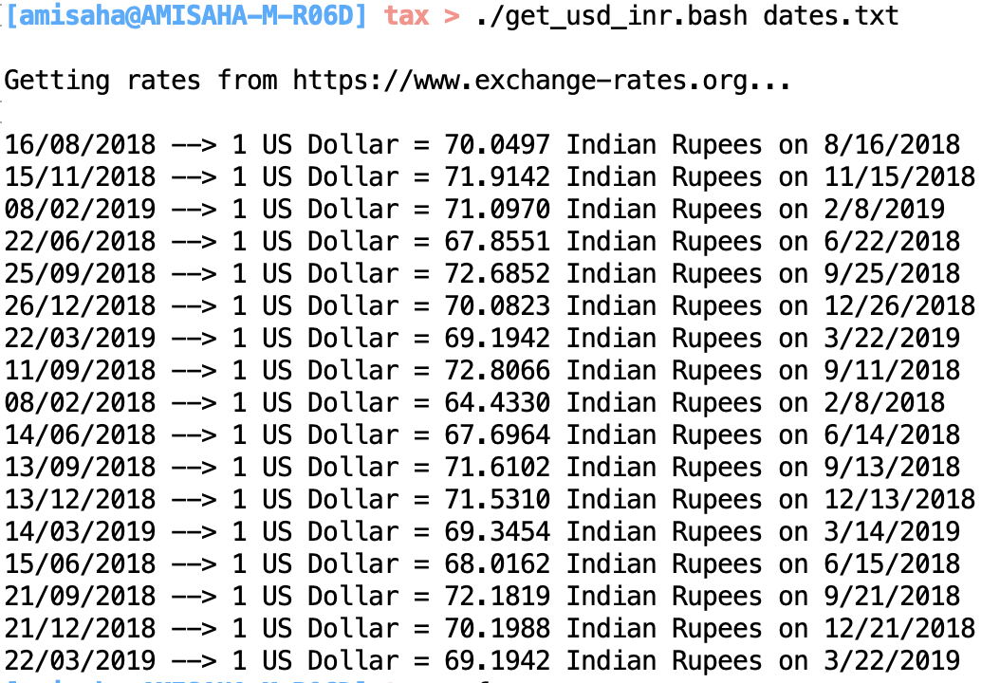

Indian tax return requires us to report any income from outside India as well.
Stocks of most multi-national companies are traded in US Dollars and hence in
order to report any capital gains and dividends from these stocks, the USD to
INR conversion has to be done for the exact date when the transaction was done.

Here is how a sample output looks like when run on the
[sample date file](./date.txt):

